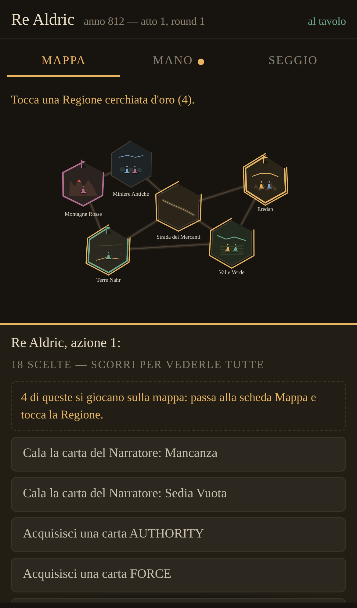
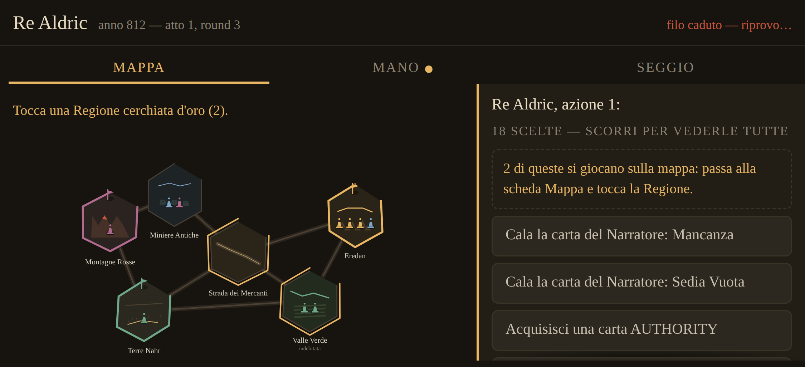
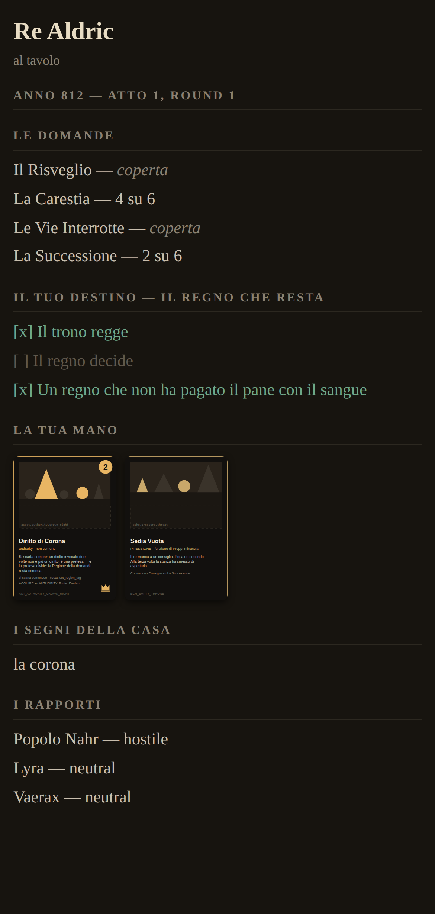
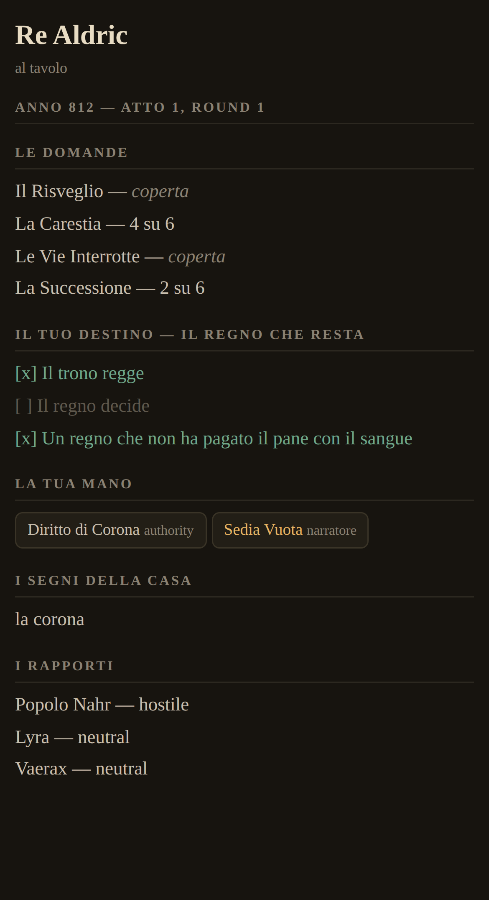
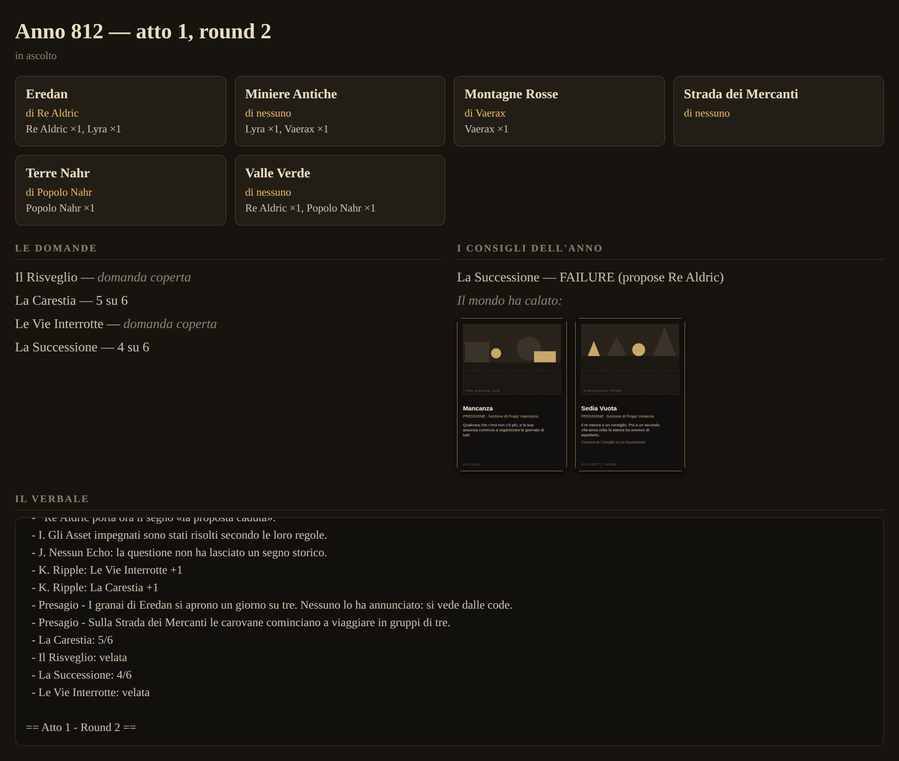

# La seduta sul tavolo grande e le console (voce 27)

Il dossier di decisione per la voce 27 — «la mappa e le indicazioni delle
carte giocate restino sul computer (o iPad), e i giocatori usino gli
smartphone come console dove avere le indicazioni segrete, le carte in
mano e tutte le informazioni di gioco». Trasporto già deciso dal
committente: **stanza locale, stessa rete**. Come per le sedute
precedenti: lo stato vero, una proposta concreta per pezzo, le domande
secche in fondo.

---

## 1. Lo stato vero (la metà difficile è già fatta)

Tutto il codice disegna *per viewer*, ed è il motivo per cui questa
feature è una ricomposizione e non una riscrittura:

- `visible_tension_value(tension_id, viewer)` (§11.1): un numero velato
  è velato *per chi guarda*, non per lo schermo.
- La mappa e il pannello prendono `render(session, viewer_id)`; il
  Destino lo vede solo chi lo giura (D-101); l'avviso «questa mossa
  spegne la tua clausola» (D-120) parla solo al suo seggio.
- Il `SeatDecider` è **uno solo** per terminale e browser (D-038), con
  l'`io` iniettato: un oggetto con `say` e `choose`. La console
  telefonica è *un terzo io*, non un terzo decider.
- Il motore è deterministico e non sa quanti schermi lo guardano; il
  salvataggio a ogni soglia c'è già (D-052) e la ripresa a metà atto è
  provata dai test.
- La sonda della visibilità (D-121) sa già misurare «chi vede cosa» in
  headless: è lo stampo per la disciplina dei segreti sul filo.

Quello che non esiste: il trasporto, l'accoppiamento seggio–telefono, le
due viste ricomposte, il rientro.

## 2. L'architettura proposta

```
   computer/iPad (HOST)                     telefoni (CONSOLE)
  ┌──────────────────────┐    stessa rete  ┌─────────────────┐
  │ motore + salvataggi  │◄──WebSocket────►│ pagina web       │
  │ vista TAVOLO         │                 │ (nessuna app,    │
  │ (mappa, carte calate,│    HTTP: l'host │  nessun negozio) │
  │  Consigli, verbale)  │    serve la     │ vista CONSOLE    │
  │ + mini server HTTP   │    pagina       │ (mano, Destino,  │
  └──────────────────────┘                 │  choose, segreti)│
                                           └─────────────────┘
```

- **L'host è la partita.** Il motore gira solo sul computer; i telefoni
  non hanno stato di gioco, solo la vista del loro seggio e le domande
  in sospeso. Un telefono non può desincronizzare niente: al massimo
  tace.
- **La console è una pagina web servita dall'host** (proposta A1):
  il telefono apre `http://<ip-del-computer>:8123`, sceglie/riceve il
  suo seggio, fine. Niente installazione, niente store, funziona su
  qualsiasi telefono della casa. Godot ha i pezzi (`TCPServer` per
  servire la pagina statica, `WebSocketPeer` per il canale). L'
  alternativa A2 — la console è l'export web di Godot già in CI — è più
  ricca ma più pesante sul telefono e più larga del necessario: la
  console mostra testo, carte e bottoni.
- **Il protocollo è l'`io` sul filo**: tre messaggi dall'host
  (`state` — il pannello del seggio filtrato; `say` — una riga di
  verbale per quel seggio; `choose` — le opzioni del decider) e uno dal
  telefono (`chosen` — l'indice). Ogni messaggio porta il numero di
  soglia: un `chosen` vecchio si scarta, un `choose` non risposto si
  ripropone.

## 3. La disciplina dei segreti sul filo

La regola dei pixel (§11.1) diventa regola dei messaggi: **il filtro sta
nell'host, prima della rete** — sul telefono arriva solo ciò che il suo
seggio ha diritto di leggere. Concretamente: la vista console si
costruisce con gli stessi `render(session, viewer_id)` di oggi, e il
serializzatore di rete rifiuta per costruzione i campi senza viewer.
La prova è una **sonda dei messaggi** in headless, gemella della sonda
della visibilità: 100 semi, ogni messaggio uscito verso ogni console,
zero campi che il viewer non avrebbe visto sul suo schermo. La Tensione
velata al telefono di chi non sa è la stessa domanda coperta del tavolo
fisico.

## 4. L'accoppiamento e il rientro

- **Accoppiamento**: all'apertura della stanza, la vista tavolo mostra
  per ogni seggio umano un **QR** (l'URL con un token di seggio) e lo
  stesso token in quattro lettere per chi il QR non lo legge. Chi
  inquadra il QR di Aldric *è* Aldric: il token è il segreto di seggio,
  e lo schermo grande smette di mostrarlo appena la console si aggancia.
- **Rientro**: il token vive nel telefono (localStorage); un telefono
  riavviato riapre la pagina, ripresenta il token, e l'host gli rimanda
  lo stato corrente più il `choose` in sospeso. Se un telefono muore
  davvero, il tavolo può rigenerare il token di quel seggio (e il
  vecchio smette di valere). La partita non aspetta mai un socket:
  aspetta una *risposta*, comunque arrivi — anche dallo schermo grande
  in emergenza (la console di riserva è la vista di oggi).

## 5. Le fasi, ognuna col suo «fatto quando»

1. **Le due viste dallo stesso mondo** (senza rete): la vista tavolo e
   la vista console come ricomposizioni degli stessi pezzi, affiancate
   sullo stesso schermo in dev. *Fatto quando*: la sonda della
   visibilità passa su entrambe; il playtest non cambia di un byte.
2. **Il filo in casa**: host HTTP+WebSocket, protocollo
   `state/say/choose/chosen`, la sonda dei messaggi. *Fatto quando*: una
   partita headless con due console simulate è identica byte per byte
   alla stessa partita senza rete; la sonda dei messaggi dà zero fughe
   su 100 semi.
3. **Il telefono vero**: la pagina console, QR, rientro. *Fatto quando*:
   il criterio della voce 27 — mappa sul computer, due telefoni, i
   segreti solo al loro seggio, un telefono riavviato rientra senza
   perdere niente.
4. **La rifinitura da tavolo**: la cronaca a metà anno sullo schermo
   grande, l'eco del cambiamento, i suoni/attese (materia di gusto, si
   decide vedendola).

## 6. I rischi onesti

- **Le reti di casa**: router con isolamento AP (il telefono non vede il
  computer) e telefoni che addormentano il WiFi. Mitigazioni: messaggio
  di diagnosi chiaro sulla vista tavolo («la console di Aldric non
  risponde da 20s»), ping periodico, e la console di riserva sullo
  schermo grande. Non si promette magia: se la rete di casa isola i
  client, lo si dice e si gioca col tablet passato di mano (la strada 1
  di COMPONENTS §7 resta valida come ripiego).
- **iPad come host**: l'export web di Godot non può aprire socket in
  ascolto dentro Safari. Finché è così, «il computer» è un computer (o
  l'app nativa su iPad, materia della 0.6+); il dossier lo dichiara
  invece di scoprirlo poi.
- **Il determinismo**: la rete non tocca il motore — l'`io` remoto
  restituisce indici come l'`io` locale. La guardia è la fase 2: partita
  con console simulate identica byte per byte.

---

## 7. Le domande secche

- **A. La console**: pagina web servita dall'host (A1, raccomandata:
  zero installazione) o export web di Godot come console (A2, più
  ricca, più pesante)?
- **B. L'accoppiamento**: QR + token di seggio sullo schermo grande ti
  va? E il tavolo deve poter *rigenerare* il token di un seggio a
  partita in corso?
- **C. Lo schermo grande**: pura vetrina (tutto si decide dai telefoni,
  raccomandata) o anche interattivo (il tavolo può toccare — utile per
  la console di riserva, rischia dita di troppo)?
- **D. L'ordine**: le fasi 1→4 come sopra, cominciando dalla
  ricomposizione senza rete?

---

## 8. Verbale delle risposte

Seduta del 2026-08-18, risposte del committente:

- **A — la console è la pagina web servita dall'host** (A1, la
  raccomandata): il telefono apre un indirizzo, niente installazione.
- **B — «ok»**: accoppiamento col QR + token di seggio, e il tavolo può
  rigenerare il token a partita in corso.
- **C — «vetrina + ispezione»**: lo schermo grande accetta solo tocchi
  che *guardano* (zoom su una Regione, il libro della cronaca, il
  verbale), mai tocchi che *decidono* — un tocco sul tabellone non ha
  identità di seggio. La console di riserva esiste ma solo su
  dichiarazione esplicita del tavolo («il telefono di Aldric è perso»),
  e l'app dice ad alta voce il costo di segretezza prima di mostrare le
  opzioni del seggio sullo schermo comune.
- **D — «ok»**: le fasi 1→4, cominciando dalla ricomposizione delle due
  viste senza rete.

**La fase 1 è eseguita** (0.1.97, [D-134](DECISIONS.md#d-134)): i
modelli di vista (`TableModel`/`ConsoleModel` — i futuri messaggi), la
vetrina con l'ispezione, la console con il `say`, il cavalletto
`dev_split.tscn`, e la sonda delle viste che perquisisce i modelli
serializzati. Playtest identico byte per byte.

**Le fasi 2 e 3 sono eseguite** (0.1.98/0.1.99,
[D-135](DECISIONS.md#d-135)/[D-136](DECISIONS.md#d-136)): il filo — la
stessa partita con due console WebSocket vere è **identica byte per
byte** a quella senza rete, e su 100 partite la perquisizione ha
passato **21.109 messaggi con zero fughe** — e il telefono vero: le
pagine console e tavolo, la stanza dal menu, la diagnosi della rete.
**Il QR è fatto** (0.1.100, [D-137](DECISIONS.md#d-137)): ogni seggio ha
il suo codice da inquadrare, e la vetrina il suo — verificati contro un
oracolo indipendente, che ha trovato tre difetti invisibili a occhio.
Restano, dichiarate: la console di riserva piena e l'inclusione di `web/`
negli export impacchettati.

## 8bis. Cosa si vede sul telefono



Tre schede — **Mappa**, **Mano**, **Seggio** — e la domanda sempre in fondo.
Le mosse che riguardano un posto **si giocano sulla mappa**: le Regioni che la
domanda offre si accendono col cerchio d'oro e il dito risponde li'. Quelle
scelte non compaiono anche fra i bottoni, perche' due strade per la stessa
mossa vogliono dire che una delle due e' quella sbagliata (D-146).



**Coricato** il telefono affianca le schede alla domanda invece di impilarle:
lo spazio di uno schermo orizzontale e' largo e basso, e impilare li' vuol dire
scorrere sempre. Cosi' si gioca senza scorrere niente.



La mano sono **le carte stampate**: la faccia arriva dall'host, disegnata dalla
stessa funzione che impagina i fogli da fustellare (D-101, D-144). Un tocco la
ingrandisce a tutto schermo.

Fotografato da un browser vero contro l'host vero (CHR_01, seme 7000, la
stanza aperta con `cli/run_room.gd`). In testa il seggio e l'anno, poi **le
domande** con le velate marcate «coperta», e in fondo — fisso, sempre a
portata di pollice — il **riquadro delle scelte**, che dice quante sono e
scorre per conto suo.



Scorrendo: **il tuo Destino** coi gradini spuntati, **la tua mano** come
cartine, **i segni della casa** e **i rapporti** con gli altri seggi. Tutto
qui e' gia' pubblico per quel seggio: la Tensione che non ha esplorato dice
«coperta» e basta, e nessuna carta di un'altra mano compare (§3, e la
perquisizione lo prova su 17.509 messaggi).

### E la vetrina, sull'iPad



La mappa e' **disegnata**, non raccontata: le stesse tessere, le stesse pedine
e gli stessi vessilli del canvas, letti dagli stessi piani (D-145) — cambia
solo la superficie. I riquadri sotto restano: sono l'ispezione al tocco.

Le carte **impegnate in Consiglio** stanno in tavola con la loro faccia, per
fronte — si sono rivelate tutte insieme in seduta, quindi ci stanno di diritto;
quelle di una seduta **ancora aperta** no, e una guardia lo verifica. Anche le
carte che **il mondo ha calato** stanno in tavola; la mano di nessuno compare
qui, ed e' una guardia che adesso c'e' davvero:
mettendo le facce e' venuto fuori che la vetrina mostrava anche le carte
*ancora in mano* ai seggi — sei invece di due — perche' leggeva tutto cio' che
il mazzo aveva lasciato. Corretto in 0.1.106 ([D-144](DECISIONS.md#d-144)),
insieme alla perquisizione che mancava: la vetrina non ha un viewer, e per
questo nessuno le aveva mai chiesto conto di niente.

Due difetti sono stati trovati proprio guardando queste foto, e corretti in
0.1.105 ([D-143](DECISIONS.md#d-143)): il tabellone a caratteri del terminale
finiva sul telefono, dove diceva due volte cose che le sezioni dicono meglio;
e le scelte oltre il bordo del riquadro sembravano non esserci.

## 9bis. L'app da scaricare (macOS)

Chi ospita il tavolo ha bisogno di **un'app vera**, non dell'export web: la
stanza apre porte in ascolto, e una pagina in un browser non puo' farlo. Da
0.1.104 la CI la costruisce a ogni run.

1. **Scaricarla**: su GitHub, scheda *Actions* → il lavoro **desktop** →
   l'ultima run verde su `main` → in fondo, l'allegato **`ECHOES-macos`**.
   Dentro c'e' `ECHOES.zip`, e dentro quello `ECHOES.app`.
2. **Aprirla la prima volta**: l'app **non e' firmata** — farlo richiede un
   certificato Apple che il progetto non ha — quindi macOS la mette in
   quarantena perche' scaricata da internet. Il modo che funziona sempre, dal
   Terminale, nella cartella dove sta l'app:

   ```
   xattr -dr com.apple.quarantine ECHOES.app
   ```

   poi doppio clic. (Il vecchio tasto destro → *Apri* funziona su alcune
   versioni di macOS e su altre no: da Sequoia in avanti la strada e'
   Impostazioni → *Privacy e sicurezza* → *Apri comunque*. Il comando sopra
   evita la lotteria.)
3. Da li' in poi e' il §9: si apre la stanza dal menu, l'iPad inquadra il QR
   della vetrina, i telefoni il proprio.

Una cosa che il pacchetto deve contenere e che a occhio non si vede: le pagine
`console.html` e `tavolo.html` **non sono risorse che Godot importa**, quindi
il filtro `all_resources` non le vedrebbe e l'app si costruirebbe benissimo per
poi servire una pagina vuota ai telefoni — un difetto che si scopre con quattro
persone sedute. Il preset le include per nome, e la CI apre il pacchetto e
verifica che ci siano davvero.

Windows e Linux non sono fatti: si aggiungono con un preset per uno, quando
serviranno.

## 9. La prova (computer + iPad + telefoni)

1. **Sul computer** (host — serve il progetto Godot, non l'export web:
   Safari non può aprire porte): `godot --path godot`, dal menu «Apro
   la stanza — console sui telefoni» (oppure dritto:
   `godot --path godot res://ui/room_screen.tscn`). Si sceglie l'anno
   e la stanza si apre: per ogni seggio compare il suo indirizzo.
2. **Sull'iPad** (la vetrina): inquadra il QR grande in testa alla
   stanza, o apri Safari su `http://<ip>:8123/tavolo`. Si aggiorna da sola a ogni
   mossa; il tocco su una Regione apre i suoi segni.
3. **Sui telefoni** (le console): ognuno **inquadra il QR del proprio
   seggio** con la fotocamera (o digita `http://<ip>:8123/?t=CODICE`).
   Il codice resta nel telefono:
   se la pagina si chiude o il WiFi cade, si riapre e si rientra da
   soli, con la domanda in sospeso riproposta.
4. **«Si comincia»**: chi è collegato in quel momento gioca dal
   telefono; i seggi senza console giocano da soli (policy). Durante la
   partita la striscia in alto dice chi è al tavolo e chi «non risponde
   da Ns»; «Rigenera il codice» taglia fuori un telefono perso.

**Se non vuoi usare l'iPad, o i telefoni, o niente di tutto questo**: la
partita di sempre e' intatta e non e' cambiata di un byte. Dal menu si sceglie
un seggio («Gioco Aldric…») e si gioca tutto sul computer, come prima della
voce 27 — le azioni sono i bottoni sotto la mappa, e le Regioni cerchiate
d'oro si cliccano. L'iPad e' un *secondo* schermo, non un pezzo obbligatorio:
anche nella stanza la vetrina e' gia' sullo schermo del computer, e chi apre
`/tavolo` sull'iPad ne vede una copia. Quello che invece **oggi non si puo'
fare** e' aprire la stanza e giocare un seggio dallo schermo grande: chi non
ha una console collegata al via e' una policy, per la regola della seduta
(«un tocco sul tabellone non ha identita' di seggio», §8 C). La console di
riserva — dichiarare «il telefono di Aldric e' perso» e riprendere quel seggio
dal computer — resta la cosa aperta, da decidere dopo la prova.

Se un telefono non vede il computer: stessa rete WiFi, e occhio
all'isolamento AP del router (il rischio dichiarato in §6). Le porte:
8123 (pagine) e 8137 (filo).
